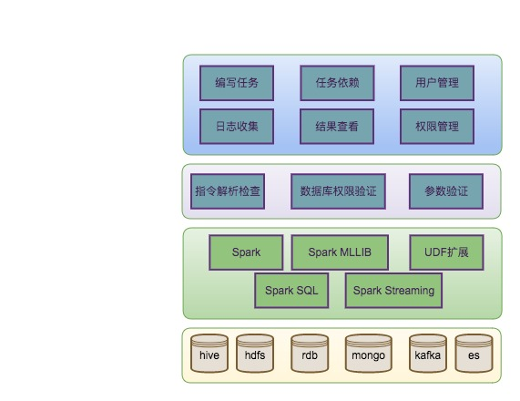
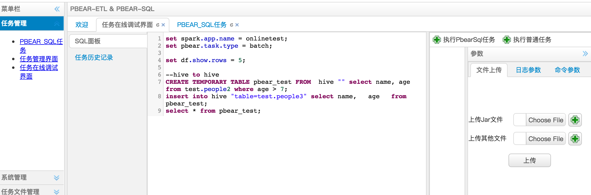
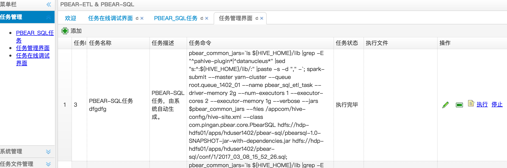
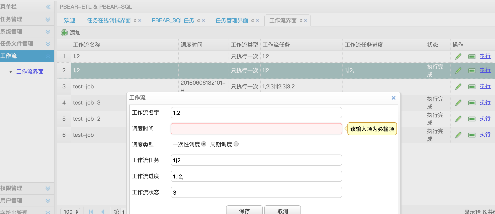
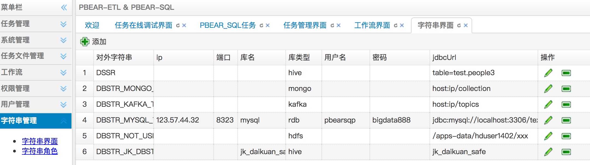

#sqlpro用户手册
[TOC]

## 一. 系统简介
目前针对大数据的sql-base处理平台，通常使用Hive HQL或Spark SQL对数据进行处理分析，但是存在以下缺点：
- 对于关系数据库、Nosql数据库（MongoDB等）、流数据（kafka），不能直接通过统一的一套SQL进行处理
- 支持的UDF函数不够丰富，如自然语言、机器学习等函数

针对上述问题，sqlpro主要做了如下改进：
1. 将多种数据源进行抽象，方便基于统一的SQL进行查询、数据读写，数据分析，目前支持包括RDB、Hive、HDFS、Mongo、ES、Kafka、Hbase
2.  sqlpro的任务指令以类HQL实现，学习成本低，方便开发人员使用
3.  丰富的内部UDF支持，包括自然语言处理，机器学习，ip地区转换等函数
4.   sqlpro基于Spark开发，对于需要多轮迭代的大数据分析处理，可充分利用分布式集群，计算效率高

sqlpro由一个web调度系统和sqlpro引擎组成。调度系统负责用户管理，权限管理、任务管理和任务调度等。对于大数据领域常用的各类数据源间导入导出、数据清洗、数据分析，可以用sqlpro语句完成，无需编写代码。sqlpro引擎将解析SQL指令，并生成对应的Spark任务进行处理。

###1.1 整体架构



如上图所示，sqlpro由一个调度系统和sqlpro引擎组成，整体架构分为4层，从上到下依次为：
**调度层**：主要由调度系统组成，用户可通过浏览器编写任务脚本，运行任务，并查看日志和返回结果。调度系统负责用户管理，操作权限管理、任务管理和任务调度等。
**指令层**：负责对任务脚本中每条指令进行解析，验证，确定任务类型，并生成一个个子任务。
**任务层**：sqlpro引擎根据任务类型，生成不同的spark任务。其中流任务需要用到Spark Streaming进行处理。所有的指令将通过Spark SQL完成。
**存储层**：由不同的数据源组成，来自不同数据源中的数据将注册为临时表，这样可统一用Spark SQL处理。

其中sqlpro引擎是整个系统核心，如下图所示。当用户编写任务脚步并提交任务后，引擎对该SQL脚本进行解析，针对不同的指令，生成不同的spark任务，spark任务在运行过程中调用数据源接口访问不同的数据源。对于不同数据源数据，将其抽象为一张SparkSQL临时表，提供统一视图，方便数据分析，比如多表join操作。


###1.2 使用流程


用户通过浏览器编写任务与sqlpro系统进行交互。各数据源可通过spark 临时表进行交互，比如join。处理后的数据可写回各数据源中。
###1.3 调度系统
调度系统是一个单独的web项目，是用户编写任务的入口，包括用户管理，用户权限管理，任务编辑，任务调度，任务依赖，日志收集，结果查看等功能。下面就sqlpro涉及到的几块进行详细介绍：
- **任务编辑**

 用户可编写任务脚本，支持sql关键字高亮提示和自动补全
 上传jar包，如自定义UDF；上传文件，如处理脚本（python）
 设置spark环境参数，针对不同任务，设置可能用到的cpu核数，内存大小等

- **任务列表**

 任务列表，可清楚看到任务描述，命令、状态
 操作任务：编辑、删除、查看日志、执行、停止

- **任务依赖**

 在任务列表里面选择多个要依赖的任务id
 1,2|3|4,6,12： 逗号分隔表示任务有依赖，会按照先后执行，|分隔表示多个任务并行执行

- **数据库字符串**

 数据库串是为了屏蔽在编写任务脚本过程中，明文显示数据库账号，密码等信息
 便于权限管理


## 二. 指令语法设计
注：关键字大小写不敏感，使用大小写均可。
### 2.1 SET指令
语法：SET *key* = *value*
功能：设置应用参数。包括Spark运行参数，Kakfa参数，自定义参数等。
```sql
-- Spark运行参数设置
set spark.app.name = Demo;
set pbear.task.type = batch;
-- 设置sql查询结果显示行数
set df.show.rows = 5;
-- 自定义参数设置
set pbear.batch_size = 1000000;
```

| 参数名      |     是否必须 |   说明   |举例| 备注|
| :-------- | --------:| :------: |
| spark.app.name    |   是 |  任务名  | demo | 不能加引号 |
| pbear.task.type | 是 | 任务类型 | batch | |
| df.show.rows | 否 | 查询结果显示行数 | 20 | 默认为10 |
| streaming.source | 否 | 流数据源类型 | kafka | 流任务必须指定 |
| streaming.interval | 否 | 流数据时间间隔，单位秒 | 10 | 流任务必须指定 |
| pbear.batch_size | 否 | 导入导出行数 | 1000000 | 建议值[500000, 3000000],如果此数值设置过大，会被修改为最大值3000000 | 

### 2.2 ADD指令
语法：ADD [jar|file] *fileName*
功能：加载文件到spark上下文。
```
-- 从HDFS指定路径导入jar到当前上下文
add jar /apps/etl/bi_cube_etl.jar;
-- 从HDFS指定路径导入文件到当前上下文,可以是python，php脚本等
add file /apps/data/parser.py;
```

### 2.3 CREATE TEMPORARY TABLE指令
 功能：从各种数据源中注册临时表。
**语法：**
CREATE TEMPORARY TABLE *tmptable* FROM *dbtype* *option* *sql*

**参数说明：**
tmptable: 临时表名
dbtype: 数据源名，目前支持hive，rdb(各类关系型数据库)，mongo，es(elasticsearch)，kafka
option: 各数据源的配置参数
sql：过滤语句为标准的SQL语法，其中的表名可根据不同数据源自由取名


*注：默认使用Hive数据库，因此计算业务中需要用到Hive中的数据，不需要显示调用create方法注册数据源。*

**示例1**：将加密关键字为RD_OUEWR_PG的关系数据库表所有字段注册为临时表pbear_test。

```sql
CREATE TEMPORARY TABLE pbear_test FROM  rdb "key=RD_OUEWR_PG" select * from people;
```

**示例2**：对于不需要加密关键字的数据源可以直接用jdbc配置信息

```sql
CREATE TEMPORARY TABLE pbear_test FROM  rdb "url=jdbc:postgresql://127.0.0.1:5432/test|user=postgres|password=123" select name, age from people where age > 7;
```

**示例3**：将HDFS目录/data/people/下格式为json的文件注册为临时表pbear_test，后面的sql为结果过滤。

```sql
CREATE TEMPORARY TABLE pbear_test FROM  hdfs "path=/data/people/|format=json"  select name, age from people where age > 7;
```

**示例4**：注册mongo表为临时表
```sql
CREATE TEMPORARY TABLE people FROM  mongo "host=localhost:27017|database=test|collection=people" select name, age from people where age > 7;
```

**示例5**：注册es数据为临时表
```sql
CREATE TEMPORARY TABLE people FROM  es "nodes=localhost|port=9200|index=test/employee|format=json" select name, age from people where age > 7;
```
**示例6**: 注册kafka流数据为临时表
```sql
CREATE TEMPORARY TABLE people FROM  kafka "broker=localhost:9092|topic=hello|offset=largest|group=pbear" select parser(line) as (name, age) from stream;
```

### 2.4 CREATE TEMPORARY FUNCTION指令
功能：UDF注册
**语法：**
CREATE TEMPORARY FUNCTION *funcName* AS *packageFullName*
**或者**
TRANSFORM(xx,xx,...) USING [script]
**说明：**UDF可以以jar包，python/php脚本等形式提供。

**示例：**使用jar包提供的UDF
```sql
-- add jar /apps/etl/bi_cube_etl.jar;
CREATE TEMPORARY FUNCTION myLen AS "com.pingan.pbear.myLen";
-- SELECT a, myLen(b) FROM T1;
```

### 2.5 TRANSFORM(xxx) USING *script*指令
功能：在4的基础上，提供脚本语言支持。
**语法：**
CREATE TEMPORARY FUNCTION *funcName* AS *packageFullName*
**方式2：**使用脚本程序提供的UDF
```sql
add file /apps/data/parser.py;
insert into test.people3 select transform(name, age) using "python parser.py" as (name, age) from test.people2;
```

### 2.6 INSERT/SELECT指令
**语法：** 使用类HQL语法。暂时支持如下两种语法，后续可以考虑增加更复杂的语法支持。
目前数据源支持hive、hdfs、RDB、Kafka、Mongo、ES，各类数据源有不同配置参数，详细请参考后文，数据源类型。
INSERT INTO dbtype *option* SELECT *XXX*;

**注：** 当结果存入HDFS时，最好显示指定存储格式。默认使用text格式。
**示例1：**
```sql
insert into hive "table=people" select name, StrLen(name) as age from test.people2;
insert into hdfs "path=/sdf/|format=json" select name, age from people;
insert into rdb  "key=RD_OOUD_RD|table=people3" select name, age from people;
insert into kafka "broker=localhost:9092|topic=hello" select name, age from people;
insert into mongo "host=localhost:27017|database=test|collection=stu" select name, age from people;
insert into es 'nodes=localhost|port=9200|index=pbear/news|format=json' select name, age from people;
```

**示例2：**存在多个select逻辑和多个insert逻辑。
```sql
t1 = select xxx from t0;
insert overwrite table pbear_market_pg.temp_table with t1;
t2 = select yyy from t1;
insert overwrite table pbear_market_pg.result_table
select xxx,yyy from t1 join t2 on t1.id = t2.id;
```
###2.7 数据转换指令
**语法：**数据转换指令用于中间数据转换，复杂的SQL查询，可添加用户udf或者脚本处理。每一步转换会建立临时表，该临时表可用于后面操作。
**示例**
```sql
T1 = select ip2country(ip) as country, day, num from product_order;
T2 = select country, day, sum(num) as total from T1 group by country, day;
insert into rdb "key=PBEAR" select country, total from T2;
```
###2.8 数据查询指令
**语法：**与一般的HQL语法一样，该语句不会创建临时表，只用于查询。
**示例**
```sql
select name, age from people;
```


-----------------------------------------------------------------------------------
-----------------------------------------------------------------------------------

##三. 数据源介绍
目前已经支持的数据源分为两大类：静态数据源和流数据源
静态数据源：RDB、HDFS、Hive、Mongo、ES
流数据源：Kafka
后续根据业务情况会添加对Hbase、Cassandra的支持，下面详细介绍每种数据源的配置参数。
###3.1 rdb：各种关系新数据

| 参数名  | 是否必须|    说明 | 举例|  备注   |
| :-------- | --------:| :------: |
| key    | 否|  加密关键字串，用于HTTP请求获取具体信息 | PG_ESDFYLWJ| 需要到调度平台注册  |
|url	|否| jdbc url信息| jdbc:postgresql://127.0.0.1:5432/test | 若不使用加密关键字串，这必须有该参数|
|user| 否| user| postgrs|	若不使用加密关键字串，这必须有该参数|
|password|否| password| 1234| 若不使用加密关键字串，这必须有该参数|

###3.2 mongo:  mongo数据库

| 参数名  | 是否必须|    说明 | 举例|  备注   |
| :-------- | --------:| :------: |
| host    |   是 |  ip和端口号  | 12.13.187.11:27017,12.13.187.12:27017 | 多个以逗号分隔 |
| database	|	是	| 库名	|  test	|
| collection | 是 | 集合名 | stu |
| user | 否 | 用户名 | pbear |
| password | 否 | 密码 | pbear123 |

**备注**：对于复杂的mongo数据，比如多层级的json，可通过下面格式访问。
比如下面关于学生信息的一条mongo数据：
```json
{
"school": {
		"sch_name": "清华",
		"sch_addr": {
			"country": "中国",
			"city": "北京"
		}
	},
"name": "xiaoming",
"age": 23
}
```
改写成sql查询关于学生学校所在的城市
```sql
select name, age, school.sch_name, school.sch_addr.city from student;
```
返回结果为

| name      |     age |   sch_name   | city |
| :-------- | --------:| :------: |
| xiaoming    |   23 |  清华  | 北京 |

对于多层级嵌套json，会出现最后层级出现相同的名，这将引起冲突，建议用as重命名
```sql
select name, age, school.sch_name as sch_name, school.sch_addr.city as sch_city from student;
```
这样嵌套的数据将被打平成，再写入mongo的时候则变为：
```json
{
"name": "xiaoming",
"age": 23,
"sch_name": "清华",
"sch_city": "北京"
}
```
即无法再回到嵌套数据格式。


###3.3 kafka: 流数据
| 参数名  | 是否必须|    说明 | 举例|  备注   |
| :-------- | --------:| :------: |
| broker    |   是 |  ip和端口号  | 12.13.187.11:9092,12.13.187.12:9092 | 多个以逗号分隔 |
| topic	|	是	| 订阅主题	|  hello,hello2	| 多个以逗号分隔 |
| offset | 否 | kafka中数据偏移量，smallest或largest | smallest | 默认为largest |
| group | 否 | 订阅分组 | pbear | 默认无分组 |
**备注**：sqlpro会将流数据当做只有一个字段line的名称为stream的表

###3.4 es: Elasticsearch
| 参数名  | 是否必须|    说明 | 举例|  备注   |
| :-------- | --------:| :------: |
| node    |   是 |  节点ip  | localhost |  |
| port	|	是	| 节点端口	|  9200	|  |
| index | 是 | es索引 | pbear/news |  |
| format | 否 | 存储格式 | json | 默认为json |

**备注**：es中也可能存在嵌套json格式，处理方法请参考mongo数据源

###3.5 hdfs:  hdfs文件系统
| 参数名  | 是否必须|    说明 | 举例|  备注   |
| :-------- | --------:| :------: |
| path    |   是 |  存储路径  | /data/order |  |
| format	|	否	| 存储格式，支持text、json、parquet |  parquet	| 默认为text |
| mode | 否 | 入库类型，目前支持append、overwrite、error、ignore | overwrite | 默认为append  |

###3.6 hive: hive数据库
| 参数名  | 是否必须|    说明 | 举例|  备注   |
| :-------- | --------:| :------: |
| table    |   否 |  表名  | test | 入库必须指定 |
| mode | 否 | 入库类型，目前支持append、overwrite、error、ignore | overwrite | 默认为append  |

**备注**: 目前只有hdfs和hive支持mode参数，

| 类型名      |     说明 |   
| :-------- | --------:| 
| append    | 追加到已经存在的表或数据后面 | 
| overwrite | 覆盖已经存在的数据 |
| errer | 若表或数据存在，报错并停止运行 |
| ignore | 若表或数据已经存在，忽略该操作 |

-----------------------------------------------------------------------------------
-----------------------------------------------------------------------------------
## 四. 任务类型
目前sqlpro支持3种任务类型，批处理任务，etl任务，流处理任务
###4.1 batch批处理任务
该类任务支持数据查询、OLAP分析，数据转换操作，适用各种静态数据源

###4.2 export导入导出任务
目前该类任务只用于从RDB数据源导入，导出到其他数据源中。此类任务不支持多表join，即不支持OLAP分析，适用各种静态数据源。export任务会将RDB中的大表分段导出，目的是为了减少内存使用。

###4.3 流数据任务
该类任务必须有一个流数据源，目前sqlpro只支持kafka。系统会将数据流当做只有一个字段为line的stream表，用户必须指定一个udtf函数或一个动态脚本对这个line字段进行处理，以生成想要的多字段临时表。

**备注**：同一个任务脚本中，只支持一个ES数据源

-----------------------------------------------------------------------------------
-----------------------------------------------------------------------------------
## 五. UDF函数
udf函数分为三类：
*udf*: 处理一个表字段返回一个表字段
*udtf*：处理一个表字段返回多个表字段
*udaf*: 处理多个表字段返回一个表字段 

目前默认支持的UDF函数有：
| 函数名      | 类型 | 功能 | 参数 |   返回类型   | 备注 |
| :-------- | --------:| :------: |
| ip2country | udf | 将ip转换为对应国家名 | ip: string | string | 若没能转换成功，则为空字符串 |
| ip2city | udf | 将ip转换为对应城市名 | ip: String | String | 若没能转换成功，则为空字符串 |
| strLen | udf | 求一个字符串的长度 | string | int | 
| ansjWordSegToString | udf | 将字符串切词 | String | String | 切词后的字符串以|分隔 |


-----------------------------------------------------------------------------------
-----------------------------------------------------------------------------------

## 六.任务脚本举例 
### 6.1 export任务举例
**示例：数据从rdb中批量导入到hive表中，每次导入2000000条数据**
```sql
set spark.app.name = demo;
set pbear.task.type = export;
— 指定每次导出数据行数
set pbear.batch_size = 2000000;

CREATE TEMPORARY TABLE pbear_test FROM  rdb "key=RD_OUEWR_pg" select name, age from people;

insert into hive "table=test.people2" select name, age from pbear_test;
```

### 6.2 batch任务举例
**示例：数据从hdfs处理后存入hdfs; 数据从mongo和rdb中join处理后存入rdb**
```sql
-- 运行参数设置
set spark.app.name = onlinetest;

set pbear.task.type = batch;


set df.show.rows = 5;



CREATE TEMPORARY TABLE pbear_test FROM  hdfs "path=hdfs://localhost:9000/data/people/|format=json"  select name, age from people where age > 7;


T1 = select name, age from pbear_test where name like "%ray";

insert into hdfs "path=hdfs://localhost:9000/data/people2/|format=json" select name, age from T1;



CREATE TEMPORARY TABLE stu1 FrOM mongo "host=localhost:27017|database=test|collection=people|user=pbear|password=pbear123" select name, age, sch.addr.city as city  from stu where age > 7;



CREATE TEMPORARY TABLE stu2 FROM  rdb "key=RD_OUEWR_pg" select name, sex from stu where sex = ‘m’;


insert into rdb  "key=RD_OUEWR_pg|table=newstu|mode=overwrite" select stu1.name, stu1.age, stu1.city, stu2.sex from stu1 inner join stu2  on stu1.name=stu2.name;


```

### 6.3 流计算
**示例：数据从kafka流中读出，join从rdb中读出的errer信息表，写入kafka中**
```sql
set spark.app.name = demo;
set pbear.task.type = streaming;

---- 指定数据源，可以为kafka或者hdfs文件，暂时只支持kafka,一个任务脚本中只支持一个流数据源

set streaming.source = kafka;

---- 指定流时间间隔,单位秒
set streaming.interval = 5;


add jar udfs-1.0-SNAPSHOT.jar;
CREATE TEMPORARY FUNCTION parser AS 'com.pingan.pbear.udtf.LineParser';



CREATE TEMPORARY TABLE log FROM  kafka "broker=localhost:9092|topic=log|offset=largest|group=pbear" select parser(line) as (doc, ip, time, err_no) from stream;

CREATE TEMPORARY TABLE error FROM  rdb “url=jdbc:postgresql://127.0.0.1:5432/test|user=postgres|password=abcd123" select err_no, err_msg from error;


insert into kafka 'broker=localhost:9092|topic=newlog' select ansjWordSegToString(log.doc) as doc, log.ip as ip, ip2city(log.ip) as city, log.time as time, error.err_msg as err_msg from log inner join error on log.err_no = error.err_no;

```
-----------------------------------------------------------------------------------
